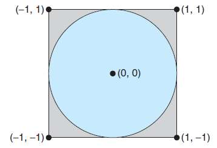

# Enunciado posible

## Enunciado tomado de un libro...

Una manera interesante de calcular $\pi$ es utilizar una técnica conocida como Monte Carlo, la cual involucra aleatorización. Esta técnica funciona de la siguiente manera: Suponga que tiene un círculo inscrito dentro de un cuadrado, como se muestra en la siguiente figura (Asuma que el radio de este círculo es 1).

  
   
  <em>Tecnica de Montecarlo para el calculo de PI</em>

Primero, genere una serie de puntos aleatorios como coordenadas simples $(x, y)$. Estos puntos deben caer dentro de las coordenadas Cartesianas que delimitan el cuadrado. Del número total de puntos aleatorios que se generan, algunos ocurrirán dentro del círculo.A continuación, estime $\pi$ realizando el siguiente cálculo:

$$\pi \approx 4 \times (\text{número de puntos en el círculo}) / (\text{número total de puntos})$$

Escriba una versión multihilo de este algoritmo que cree un hilo separado para generar una cantidad de puntos aleatorios. El hilo contará el número de puntos que ocurran dentro del círculo y almacenará ese resultado en una variable global. Cuando este hilo haya finalizado, el hilo padre calculará y mostrará el valor estimado de $\pi$. Vale la pena experimentar con el número de puntos aleatorios generados. Como regla general, cuanto mayor sea el número de puntos, más cercana será la aproximación a $\pi$. 

## Otro problema

La secuencia de Fibonacci es la serie de números 0, 1, 1, 2, 3, 5, 8, .... Formalmente, se puede expresar como:

$$
\begin{align*}
fib_0 &= 0 \\
fib_1 &= 1 \\
fib_n &= fib_{n-1} + fib_{n-2}
\end{align*}
$$

​Escriba un programa multihilo que genere la secuencia de Fibonacci. Este programa debe funcionar de la siguiente manera: en la línea de comandos, el usuario ingresará la cantidad de números de Fibonacci que el programa debe generar. El programa creará entonces un hilo secundario que generará los números de Fibonacci, almacenando la secuencia en una estructura de datos que pueda ser compartida por los hilos (un arreglo es probablemente la estructura de datos más conveniente). Cuando el hilo secundario finalice su ejecución, el hilo principal imprimirá la secuencia generada por dicho hilo. Debido a que el hilo principal no puede comenzar a imprimir la secuencia de Fibonacci hasta que el hilo secundario termine, el hilo principal deberá esperar a que el hilo secundario finalice. 

## Referencias

1. http://misovirtual.virtual.uniandes.edu.co:8080/codelabs/maia-rl-montecarlo/index.html#0
2. https://colab.research.google.com/github/aizardar/blogs/blob/master/_notebooks/2020-11-18-Pi_Monte_Carlo.ipynb
3. https://www.101computing.net/estimating-pi-using-the-monte-carlo-method/
4. https://www3.nd.edu/~pbui/teaching/cdt.30010.fa16/notebook03.html
5. https://github.com/MylesJohnson/Monte-Carlo-Pi

